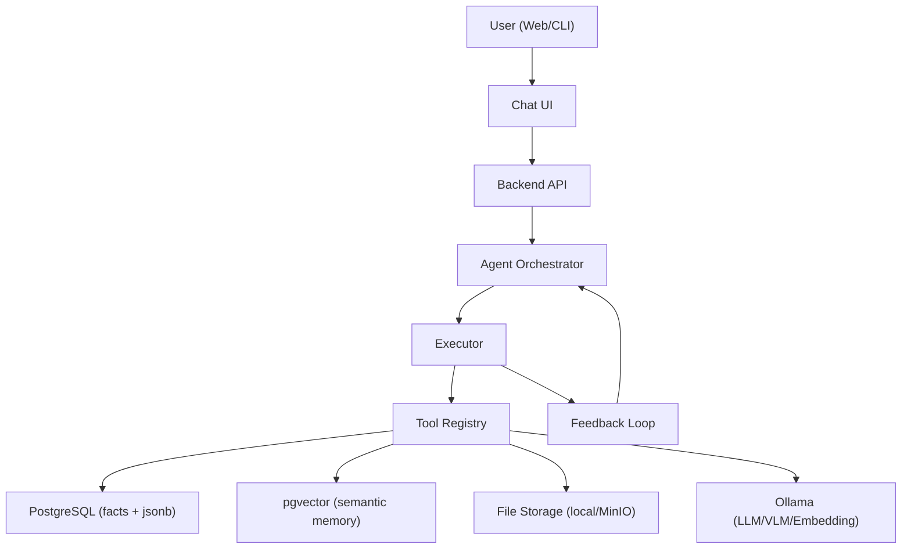

## 1. 定位：从“AI CRUD”到“Agent 系统”

PDIS 的目标是一个个人决策辅助 Agent：目标驱动、可循环闭环、可调用工具、可检索记忆、可复盘引用依据。对比传统“输入→输出”的问答/流程程序，PDIS 必须在架构层面体现以下组件：

- Goal：用户目标与约束（时间/代价/风险偏好/关系边界）
- Perception：输入与附件解析（图片/文本/结构化抽取）
- Memory：长期记忆（主数据 + 向量检索）与短期工作记忆（本次会话）
- Reasoning / Planning：任务拆解与计划摘要（高层步骤）
- Tools：查询/写入数据库、检索向量、附件入库、生成侧写与决策建议
- Executor：工具执行、重试、失败降级、输出校验
- Feedback Loop：基于执行结果判断是否继续、是否澄清、是否改写计划

## 2. 总体架构

## 3. 关键运行时流程（RAG + Tool Calling + 闭环）

### 3.1 对话一次运行（单轮）

1. 目标与约束识别：从用户输入提取“目标、约束、涉及人物、关键风险点”。
2. 计划摘要生成：输出高层计划（可折叠展示），例如“先查人物画像→召回相似历史→生成方案与话术→输出风险与替代方案”。
3. 记忆注入（RAG）：
   - 向量化用户输入（embedding）
   - 从 pgvector 检索相似人物/事件/历史记录（top-k + metadata 过滤）
   - 拼接“可用上下文”（人物侧写摘要、历史决策摘要、相关事件证据）
4. 工具执行（Tool Calling）：
   - 根据计划与缺口，自动调用工具（查档/写档/入库/检索）
   - 对工具输出做校验与归一化（JSON Schema）
5. 决策建议生成：输出可行性/置信度/关键依据/行动步骤/风险/话术。
6. 沉淀与审计：
   - 写入对话消息、引用记忆列表、工具调用轨迹（可用于复盘与纠错）
   - 写入人物侧写版本（如有更新）、写入决策记录

### 3.2 澄清对话（多轮闭环）

当目标/约束不清晰或关键信息缺失时，不以“补字段表单”结束，而进入澄清对话：

- Orchestrator 判断缺口类型：目标不明 / 约束冲突 / 证据不足 / 人物不确定
- 生成可回答的澄清问题（每次 1~3 个，避免压迫）
- 用户补充后重新运行：记忆检索与工具调用会复用已有工作记忆，并可增量更新人物档案/事件证据

## 4. 技术选型（MVP 可落地）

- 后端：Python + FastAPI（SSE/WebSocket 支持流式输出；适合 Tool API 与鉴权）
- 数据：PostgreSQL（主数据）+ pgvector（语义检索）
- 向量化：Ollama embedding（如 nomic-embed-text）
- LLM：Ollama 本地模型（qwen3/qwen2.5 系列；多模态可用 qwen2.5vl）
- Redis：可选（会话短期缓存、后台任务、幂等去重）
- 附件：本地文件系统（MVP）或 MinIO（对象存储）

## 5. Orchestrator 设计（两种实现路径）

### 5.1 轻量自研（先落地）

- 自研 Orchestrator 负责：计划摘要、工具选择、循环判定、失败降级与输出校验
- 优点：透明、可控、易调试；适合快速迭代与验证业务

### 5.2 引入 LangGraph（更 Agent 化的编排）

将 Agent 的闭环显式建模为图：

- Node：Plan / RetrieveMemory / RunTool / Validate / Decide / Persist
- Edge：基于工具结果与置信度决定下一步（继续/追问/结束）
- 优点：复杂策略更易表达；便于扩展更多工具与分支

## 6. Tool 接口定义（最小集合）

工具不是“页面按钮”，而是 Orchestrator 可自动调用的能力接口：

- `search_person_profile(query: str) -> list[PersonCandidate]`
- `get_person_profile(person_key: str) -> PersonProfile`
- `upsert_person_profile(person_key: str, patch: dict) -> PersonProfile`
- `append_interaction(person_key: str, event: dict) -> InteractionEvent`
- `query_decision_history(criteria: dict) -> list[DecisionRecord]`
- `semantic_search(text: str, scope: dict) -> list[MemoryHit]`
- `ingest_attachment(file_ref: str) -> EvidenceSummary`
- `analyze_decision(context: dict) -> DecisionResult`

## 7. 记忆层（PostgreSQL + pgvector）

记忆层需要同时承载两类数据：

- 主数据（facts）：用户、会话、人物、事件、决策记录（JSONB 适合存结构化输出与审计）
- 语义数据（vectors）：人物侧写摘要、事件文本、历史决策摘要、关键对话片段（embedding + metadata）

检索策略建议：

- 先过滤（user_id、时间范围、人物关联）后向量检索
- top-k 结果做去重与摘要（避免上下文爆炸）
- 输出中记录引用来源（用于 UI “记忆引用”展示与审计）

## 8. 可见执行（UI 需要承载的 Agent 信息）

为了让用户感受到“Agent 在动”，但又不暴露敏感推理细节，UI 需展示：

- 计划摘要（Plan Summary）：高层步骤（可折叠）
- 工具执行状态（Tool Runs）：tool name / success / duration / result summary
- 记忆引用（Memory Used）：人物/事件/历史记录引用列表
- 附件证据（Evidence）：解析摘要与引用位置
