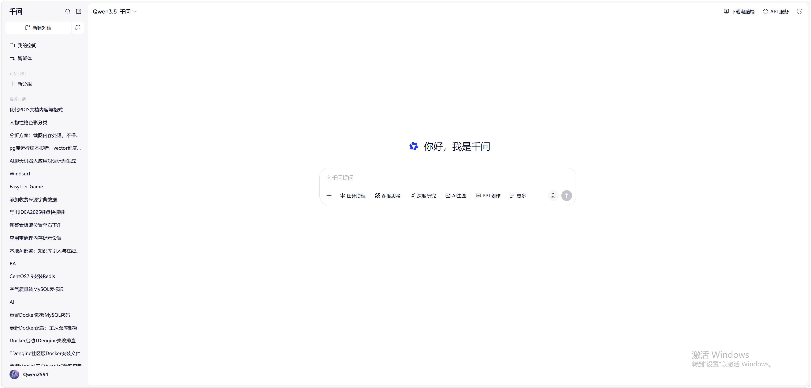

基于桌面端优先（desktop-first）的本地 Web UI 设定；如需参考现有草图：

## 全局设计规范
- Layout：整体采用「顶部导航 + 主内容区」；主内容区最大宽度 1120px 居中，左右留白 24px。
- Meta 信息（通用）：
  - title：PDIS 个人决策小秘书
  - description：本地运行的决策支持助手，沉淀人物档案与历史建议。
  - Open Graph：og:title/og:description/og:type=website
- Global Styles（设计 Token）：
  - 背景：#0B1220（深色）/ 内容卡片：#111827
  - 文字：主文 #E5E7EB，次级 #9CA3AF
  - 主色：#3B82F6（Primary），警示：#F59E0B，风险：#EF4444，成功：#10B981
  - 字体层级：H1 24/32，H2 18/28，正文 14/22，辅助 12/18
  - 按钮：Primary 实心；Hover 提亮 8%；Disabled 降低不透明度
  - 链接：默认主色，Hover 下划线
- 交互与状态：
  - LLM 生成中：输入区禁用 + 顶部线性进度条；输出区域显示“逐步追加”的流式文本。

## 页面 1：对话决策页（/）
- Page Structure：左右两栏（桌面端）
  - 左栏（约 360px）：人物快捷区 + 最近历史
  - 右栏（自适应）：对话与结果输出
- Sections & Components：
  1. 顶部导航（全局）：Logo「PDIS」、导航项「对话 / 人物 / 历史」。
  2. 输入卡片：多行文本框（支持粘贴）、附件上传、按钮「开始分析」。
  3. 澄清对话区（条件触发）：当目标/约束不清晰时，以多轮对话形式呈现澄清问题，并支持继续运行。
  4. Agent 运行面板（新增，承载“思维流/执行流”但不暴露敏感推理细节）：
     - 计划摘要（Plan Summary）：高层步骤列表（可折叠）
     - 工具执行状态（Tool Runs）：展示每个工具调用的名称、耗时、成功/失败、产物摘要
     - 记忆引用（Memory Used）：列出本次回答引用的人物/事件/历史记录（可点击跳转）
     - 证据附件（Evidence）：显示附件解析摘要与引用位置
  5. 结果卡片：
     - 可行性标签（可行/有条件可行/不可行）
     - 关键依据（列表）
     - 行动计划（≤5 步的编号列表）
     - 风险提示（红色强调）
     - 可选话术建议（可复制）
  6. 保存提示：分析完成后自动保存，显示「已写入历史记录」。

## 页面 2：人物档案页（/profiles）
- Page Structure：上方工具条 + 下方两列
  - 左：人物列表（可滚动）
  - 右：人物详情（默认空态引导选择）
- Sections & Components：
  1. 工具条：搜索框（按姓名/称谓）、按钮「新建人物」。
  2. 人物列表项：头像占位、姓名/角色/关系、最近更新时间。
  3. 人物详情：
     - 基本信息（称谓/角色/关系）可编辑
     - 性格侧写（MBTI 类型 + 置信度 + 依据摘要 + 优势/风险点）
     - 侧写版本：展示历史版本列表，允许切换对比
     - 互动时间线：按时间倒序追加“事件-结果”，提供「追加互动」表单
  4. 关联入口：按钮「查看相关历史」，跳转到 /history 并带筛选条件。

## 页面 3：历史记录页（/history）
- Page Structure：列表为主，支持进入详情
- Sections & Components：
  1. 筛选区：关键词输入、时间范围（可选）、按钮「搜索」。
  2. 历史列表：每条显示「场景摘要、涉及人物、可行性、创建时间」。
  3. 详情页（/history/:recordId）：
     - 完整展示当次分析（与对话页的结果卡片一致）
     - 按钮「基于此记录再次分析」：跳回 / 并预填 userInput（允许你修改后再跑）。
