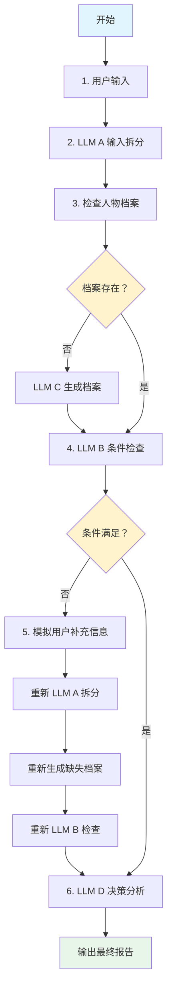

# PDIS 系统测试流程说明文档

## 1. 概述

本文档详细说明了 `test_pdis_simple.py` 测试文件的代码流程和架构设计。该测试实现了 PDIS（个人决策小秘书）系统的核心工作流程，包含四个主要 LLM 模块的协同处理。

---

## 2. 系统架构

### 2.1 核心组件

```
PDIS 系统
├── ReportManager (报告管理器)
│   ├── 负责管理 LLM 生成的报告
│   ├── 实现上下文压缩和 RAG 策略
│   └── 支持历史报告的管理和查询
│
└── PDISPipelineTest (核心流程测试类)
    ├── LLM A: 输入拆分模块
    ├── LLM B: 条件判断模块
    ├── LLM C: 人物档案生成模块
    └── LLM D: 决策分析模块
```

### 2.2 模型配置

系统使用以下 LLM 模型：

| 模块 | 模型名称 | 用途 |
|------|---------|------|
| LLM A | qwen2.5:7b-instruct | 输入拆分，识别关键要素 |
| LLM B | qwen2.5:7b-instruct | 条件判断，检查信息完整性 |
| LLM C | qwen2.5:7b-instruct | 人物档案生成，性格分析 |
| LLM D | qwen3:8b | 重大决策分析 |

---

## 3. 核心类详细说明

### 3.1 ReportManager（报告管理器）

**职责：** 管理 LLM 生成的报告，实现 WCI 模式（Write-Compress-Isolate）

#### 主要方法

1. **`__init__(storage_file)`**
   - 初始化报告管理器
   - 加载已存在的报告
   - 提取各类型报告的摘要

2. **`save_report(report_type, content)`**
   - **W (Write)**: 保存完整报告到 JSON 文件
   - **C (Compress)**: 生成报告摘要
   - **I (Isolate)**: 独立存储不同类型的摘要

3. **`get_context(report_type)`**
   - 实现 RAG 策略中的 Select（选择）步骤
   - 根据报告类型获取最相关的历史摘要

4. **`_generate_summary(content)`**
   - 生成报告摘要（测试版简化实现）
   - 生产环境应调用 LLM 生成专业摘要

#### 数据结构

```json
{
  "timestamp": "ISO 格式时间戳",
  "type": "报告类型",
  "content": "报告内容"
}
```

---

### 3.2 PDISPipelineTest（核心流程类）

**职责：** 实现四阶段工作流，严格按照业务文档顺序执行

#### 属性说明

- `person_registry`: 人物档案库（key: person_key）
- `current_context`: 当前分析上下文（缓存 LLM A 拆分结果）
- `report_manager`: 报告管理器实例

---

## 4. 四大核心模块详解

### 4.1 LLM A: 输入拆分模块

**方法：** `run_llm_a(user_text)`

**核心功能：** 从用户输入中提取所有关键元素

#### 处理流程

1. 接收用户原始输入文本
2. 构建结构化提示词，要求提取：
   - 所有人物（包括角色、态度、特征）
   - 所有时间信息（日期、星期、截止时间）
   - 所有地点信息
   - 场景摘要（1-2 句话）
   - 为每个人物生成唯一的 person_key

#### Person Key 生成规则

```python
# 格式：[Role]_[LastName] 或 [Role]_ID
# 示例：
"技术部负责人" -> "Technical_Manager"
"后端负责人" -> "Backend_Lead"
"老板" -> "CEO"
"老板娘" -> "COO"
```

#### 返回结构

```json
{
  "identified_persons": [
    {
      "mention": "人名",
      "person_key": "唯一标识",
      "confidence": 0.9,
      "description": "人物描述",
      "original_name": "原始人名"
    }
  ],
  "time_info": {
    "raw_text": "原始时间文本",
    "date": "解析后的日期"
  },
  "location_info": "地点信息",
  "scenario_summary": "场景摘要",
  "missing_elements": [],
  "user_text": "原始用户输入"
}
```

---

### 4.2 LLM C: 人物档案生成模块

**方法：** `generate_person_profile(person_key, description)`

**核心功能：** 使用九型人格理论分析人物性格，生成完整档案

#### 九型人格系统

```
1. perfect (完美型): 追求正确
2. helpful (助人型): 寻求认同
3. accomplished (成就型): 目标导向
4. romantic (浪漫型): 情感深度
5. observational (观察型): 求知超脱
6. skeptical (怀疑型): 安全忠诚
7. hedonic (享乐型): 享受自发
8. leadership (领导型): 果断控制
9. peaceful (和平型): 和谐平和
```

#### 处理流程

1. 从上下文中获取完整用户输入
2. 构建提示词，包含：
   - 九型人格系统说明
   - 人物 key 和描述
   - 完整上下文参考
3. 调用 LLM 生成性格档案

#### 输出结构

```json
{
  "person_key": "Technical_Manager",
  "identity_summary": "角色和特征摘要",
  "personality_report": {
    "core_traits": ["特质 1", "特质 2"],
    "communication_style": "沟通风格",
    "decision_focus": "决策优先级",
    "personality_color": "leadership",
    "personality_original": "领导型",
    "strengths": ["优势 1", "优势 2"],
    "weaknesses": ["弱点 1", "弱点 2"]
  },
  "profiling_report": {
    "decision_drivers": ["决策驱动因素"],
    "pressure_points": ["压力点"],
    "likely_reactions": ["可能反应"]
  }
}
```

#### 关键特性

- **语言一致性**: `personality_original` 字段必须与输入语言一致（中文输入使用中文术语）
- **上下文完整性**: 基于完整用户输入进行分析，而非仅依赖描述

---

### 4.3 LLM B: 条件判断模块

**方法：** `run_llm_b()`

**核心功能：** 判断当前信息是否满足分析条件

#### 检查项目

1. ✅ 时间信息（date）是否存在
2. ✅ 地点信息是否存在
3. ✅ 场景摘要是否存在
4. ✅ 每个人物的 personality_color 是否存在

#### 输入数据

```python
context_data = {
    "time_info": {...},
    "location_info": "...",
    "scenario_summary": "...",
    "identified_persons": [...],
    "person_registry": {...}
}
```

#### 输出结构

```json
{
  "ready": true/false,
  "missing_fields": ["field1", "field2"],
  "followup_questions": ["问题 1", "问题 2"]
}
```

#### 缺失字段示例

- `time_info.date`: 缺少日期信息
- `location_info`: 缺少地点信息
- `person_profile:XXX`: 缺少某人物档案
- `personality_color:XXX`: 缺少某人物性格分析

---

### 4.4 LLM D: 决策分析模块

**方法：** `run_llm_d()`

**核心功能：** 基于人物档案和场景进行可行性分析，生成决策建议

#### 处理流程

1. **获取历史上下文**
   - 从 ReportManager 获取历史决策分析摘要
   - 用于 RAG 策略，提供连续性分析

2. **构建人名映射**
   ```python
   name_mapping = {
       "Technical_Manager": "技术部负责人",
       "Backend_Lead": "后端负责人",
       "CEO": "老板"
   }
   ```

3. **收集目标人物档案**
   - 从 person_registry 中提取所有相关人物档案

4. **构建提示词**
   - 包含历史上下文
   - 人名映射表
   - 场景和人物档案信息

5. **二次人名替换**
   - 确保输出中使用原始人名（如"技术部负责人"）
   - 避免使用 person_key（如"Technical_Manager"）

#### 输出结构（JSON）

```json
{
  "feasibility": "可行性描述",
  "confidence": 0.85,
  "key_reasons": ["原因 1", "原因 2"],
  "execution_plan": ["步骤 1", "步骤 2"],
  "risks": ["风险 1", "风险 2"],
  "missing_info": ["缺失信息 1"]
}
```

#### 客户友好报告

转换为自然语言格式：

```
决策可行性分析报告：
可行性：高
信心度：0.85
关键原因：原因 1, 原因 2
执行计划：步骤 1, 步骤 2
风险：风险 1, 风险 2
缺失信息：缺失信息 1
```

#### 报告保存

- **系统内部报告**: JSON 格式保存到 `full_reports.json`
- **客户报告**: 自然语言格式返回给用户

---

## 5. 完整执行流程

### 5.1 主流程方法

**方法：** `run_full_pipeline()`

### 5.2 执行步骤



### 5.3 详细步骤说明

#### 步骤 1: 用户输入（模拟场景）

```python
user_text = """
下面想让你分析一个事情，我们要在本周五做年终总结的 PPT 的演讲...
"""
```

包含复杂的职场场景，涉及多个人物和关系。

#### 步骤 2: LLM A 输入拆分

- 识别人物：技术部负责人、后端负责人、老板、老板娘等
- 提取时间：本周三、本周五
- 生成场景摘要
- 为每个人物生成 person_key

#### 步骤 3: 人物档案生成（按需）

遍历所有识别出的人物：
- 如果档案不存在，调用 LLM C 生成
- 存储到 person_registry

#### 步骤 4: LLM B 条件检查

检查所有必需字段：
- 如果 `ready=false`，进入补充流程
- 如果 `ready=true`，直接进入 LLM D

#### 步骤 5: 信息补充（如需要）

针对缺失字段生成补充内容：
```python
supplement = [
    "本周三下午是 2026 年 2 月 15 日，本周五是 2026 年 2 月 17 日",
    "地点：公司三楼会议室",
    "Technical_Manager 的详细描述：..."
]
```

重新执行 LLM A → 重新生成档案 → 重新检查条件

#### 步骤 6: LLM D 决策分析

- 整合所有人物档案
- 结合历史分析摘要
- 生成可行性分析报告
- 保存报告到 full_reports.json

#### 步骤 7: 输出结果

打印：
- 最终决策分析报告
- 报告保存路径
- 报告摘要

---

## 6. 数据流图

```
用户输入
    ↓
[LLM A] 输入拆分
    ↓
├─→ identified_persons → [LLM C] → person_registry
├─→ time_info          ↗
├─→ location_info     ↗
└─→ scenario_summary ↗
              ↓
        [LLM B] 条件检查
              ↓
        {ready: true?}
              ↓
         [LLM D] 决策分析
              ↓
         ReportManager 保存报告
              ↓
         客户友好报告输出
```

---

## 7. 关键技术特性

### 7.1 人名映射机制

**问题：** LLM 处理使用英文 person_key，但用户需要看到原始人名

**解决方案：**
1. LLM A 中记录 `original_name` 字段
2. 构建 `name_mapping` 字典
3. LLM D 输出后进行二次替换

```python
# 第一次：LLM A 中保存
person["original_name"] = person["mention"]

# 第二次：LLM D 后处理
for key, original_name in name_mapping.items():
    result[field] = [s.replace(key, original_name) for s in result[field]]
```

### 7.2 RAG 策略实现

**WCI 模式：**
- **Write（写入）**: 保存完整报告
- **Compress（压缩）**: 生成摘要
- **Isolate（隔离）**: 分类存储摘要

**Select（选择）:**
- 根据报告类型检索相关摘要
- 为 LLM D 提供历史上下文

### 7.3 九型人格本地化

```python
# 英文术语 → 中文术语映射
"leadership" → "领导型"
"peaceful" → "和平型"
# ... 其他类型
```

确保 `personality_original` 字段与输入语言一致。

### 7.4 错误处理

**JSON 解析容错：**
```python
try:
    if raw_text.startswith('{') and raw_text.endswith('}'):
        return json.loads(raw_text)
    else:
        # 尝试提取第一个 JSON 对象
        start = raw_text.find('{')
        end = raw_text.rfind('}') + 1
        json_str = raw_text[start:end]
        return json.loads(json_str)
except:
    print("⚠️ JSON 解析失败")
    return {}  # 避免崩溃
```

---

## 8. 配置文件和依赖

### 8.1 Ollama API 配置

```python
response = requests.post(
    "http://192.168.1.8:11434/api/generate",
    json={
        "model": model_name,
        "prompt": prompt_text,
        "stream": False
    },
    timeout=600
)
```

### 8.2 数据存储

- **报告存储**: `full_reports.json`
- **人物档案**: 内存中的 `person_registry` 字典

---

## 9. 测试场景示例

### 9.1 输入样例

```python
user_text = """
下面想让你分析一个事情，我们要在本周五做年终总结的 PPT 的演讲...
（包含多个人物、时间压力、职场关系等复杂情境）
"""
```

### 9.2 预期输出

1. **结构化输出**（JSON）:
   - 可行性评估
   - 信心度评分
   - 关键原因列表
   - 执行计划步骤
   - 风险评估
   - 缺失信息

2. **客户友好输出**（自然语言）:
   - 连贯的分析报告
   - 使用原始人名/角色称呼
   - 中文输出

---

## 10. 扩展和优化建议

### 10.1 当前限制

1. **摘要生成**: 使用简单的文本截断，未调用 LLM 生成专业摘要
2. **人物档案**: 存储在内存中，重启后丢失
3. **RAG 策略**: 仅支持单一报告类型检索

### 10.2 优化方向

1. **数据库集成**: 使用 MongoDB/PostgreSQL 存储报告和档案
2. **向量检索**: 引入 Qdrant/Pinecone 进行语义检索
3. **摘要优化**: 使用 LLM 生成高质量摘要
4. **缓存策略**: 对频繁访问的人物档案进行缓存
5. **并发处理**: 并行生成多个人物档案

---

## 11. 运行说明

### 11.1 前置条件

1. 安装依赖：
   ```bash
   pip install requests
   ```

2. 确保 Ollama 服务可用：
   ```bash
   # 检查服务状态
   curl http://192.168.1.8:11434/api/tags
   ```

3. 拉取所需模型：
   ```bash
   ollama pull qwen2.5:7b-instruct
   ollama pull qwen3:8b
   ```

### 11.2 运行测试

```bash
cd D:\workspaceAI\pyAiTest\test
python test_pdis_simple.py
```

### 11.3 查看输出

- **控制台输出**: 实时显示各 LLM 模块的输入输出
- **报告文件**: `full_reports.json`
- **摘要信息**: 控制台最后打印的报告摘要

---

## 12. 总结

`test_pdis_simple.py` 实现了 PDIS 系统的完整核心流程，具有以下特点：

✅ **模块化设计**: 四大 LLM 模块职责清晰，易于维护和扩展  
✅ **WCI 模式**: 实现报告管理的 Write-Compress-Isolate 策略  
✅ **RAG 支持**: 利用历史报告摘要增强决策分析  
✅ **本地化处理**: 支持中英文混合输入和输出  
✅ **容错机制**: 完善的 JSON 解析和信息验证  
✅ **用户友好**: 人名映射、自然语言报告输出  

该测试文件为 PDIS 系统提供了完整的端到端验证，可作为后续开发和优化的基础参考。
